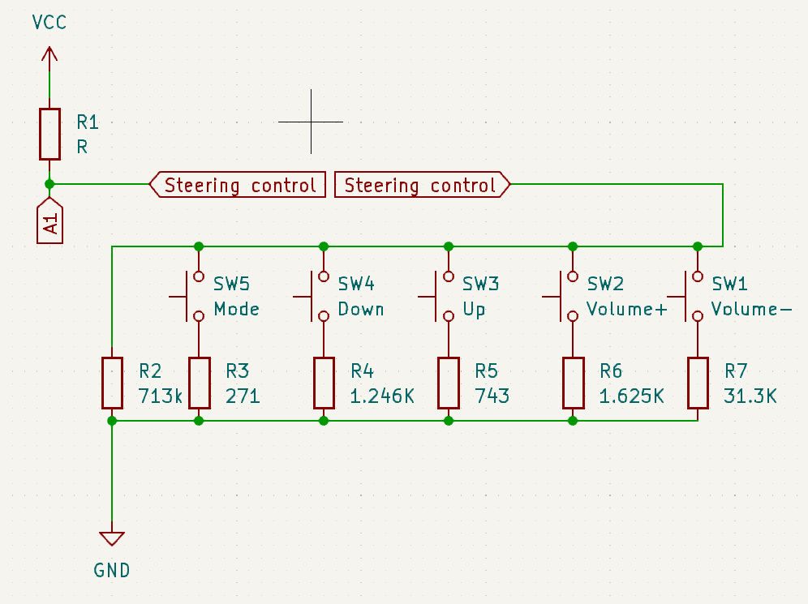

### Steering wheel control

MOSFET irf520 module

|  |        |
|--|--------|
|V+|V-      |
|V-|V+      |
|VIN|Car    |
|GND|Car    |
|SIG|Arduino|
|VCC|Arduino|
|GND|Arduino|

The circuit to detect steering wheel button press is a voltage divider. Steering control module acts as lower part of voltage divider and it's two wires are connected to the ground and analog pin of the microcontroller board. Another resistor is connected between VCC and analog pin.

V = IxR

|R   |DMM |Button|
|----|----|------|
|71.2|200K|      |
|271 |2K  |Mode  |
|1246|2K  |Down  |
|743 |2K  |Up    |
|1625|2k  |+     |
|3.13|20K |-     |

| Number | Color | Description |
|--|--|--|
|3|Green-Grey|Key1, Tip, Steering wheel control|
|10|Violet|Key2, Ground|
|11|Pink|Mode: connect to ground to change lcd mode|